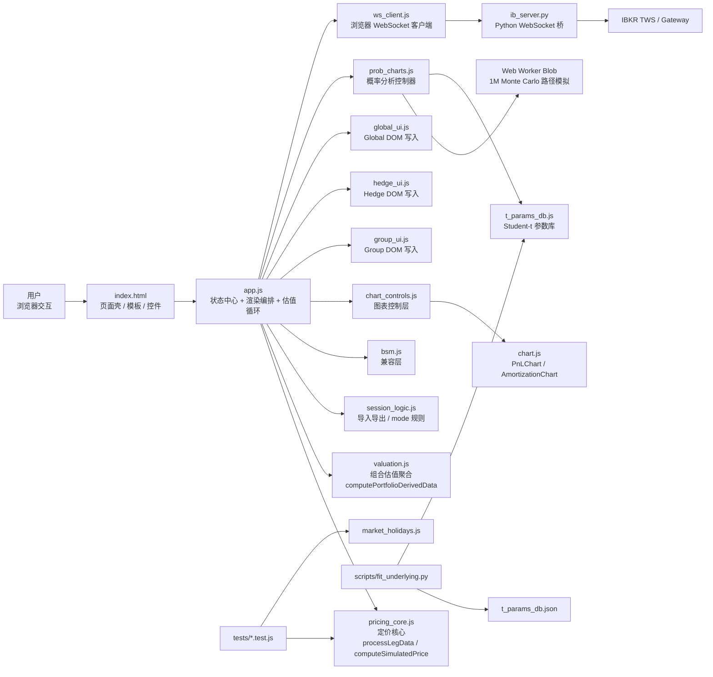
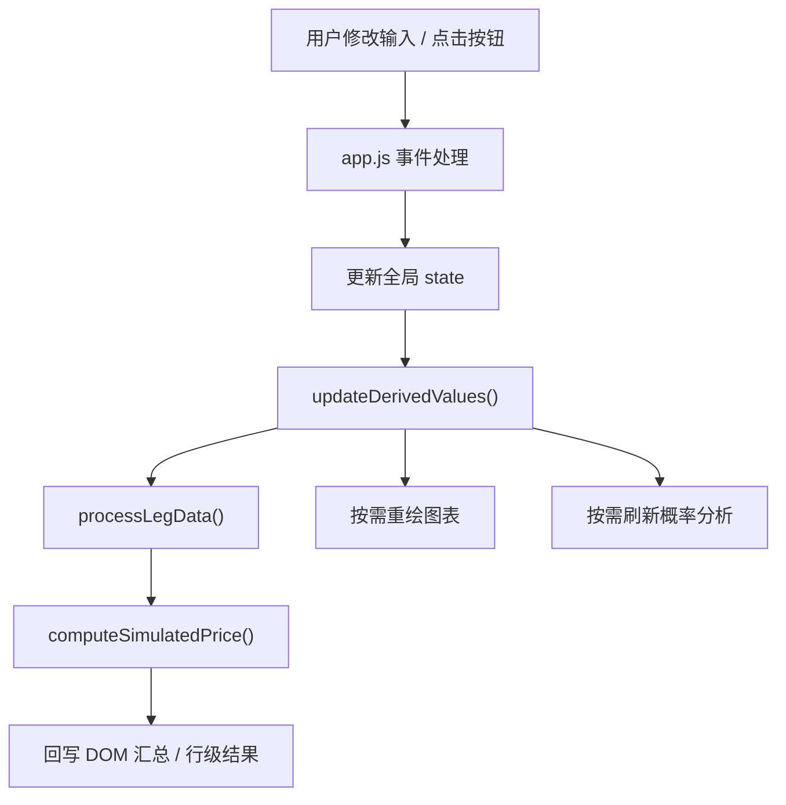
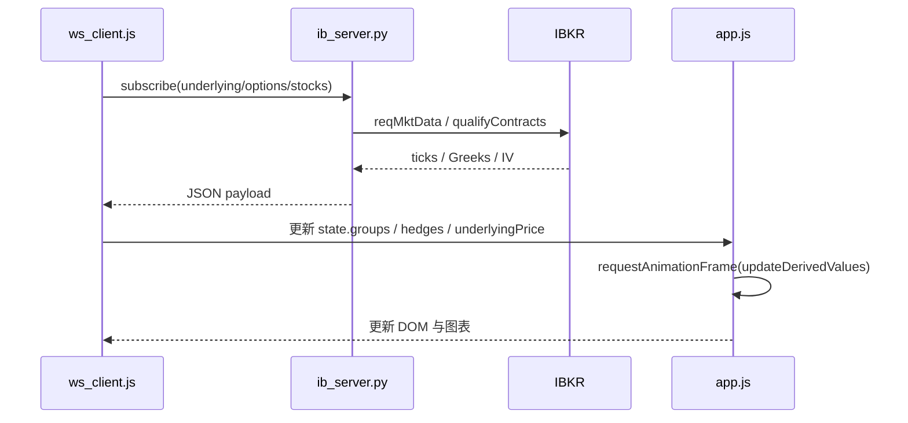
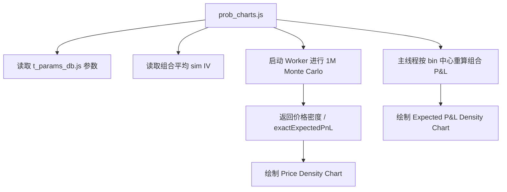

# Option Combo Simulator 架构说明

## 1. 一句话总结

这是一个**无构建步骤、无模块系统**的本地浏览器应用：

- `index.html` 提供页面壳和模板
- `app.js` 维护全局状态、驱动渲染和估值循环
- `pricing_core.js` 是纯定价单一事实来源
- `valuation.js` 是纯组合估值与聚合层
- `session_logic.js` 是纯会话导入/导出与 mode 规则层
- `bsm.js` 是兼容层
- `chart.js` + `chart_controls.js` 负责图表
- `prob_charts.js` 负责概率分析与 Monte Carlo Worker
- `ws_client.js` + `ib_server.py` 提供可选的 IBKR 实时行情

项目本质上是一个“**全局状态 + 全局函数 + Canvas 图表 + 可选本地 WebSocket 后端**”的单体前端应用。

## 2. 总体架构图



## 3. 运行分层

### 3.1 UI 壳层

由 `index.html` + `style.css` 组成，负责：

- 左侧场景控制面板
- 全局估值卡片
- 全局 P&L / 全局 amortized / 概率分析卡片
- Combo Group 模板、Leg 行模板、Hedge 行模板

特点：

- 大量 DOM 结构直接写在 HTML 中
- 通过 `template` 节点让 `app.js` 动态克隆
- 通过内联 `onclick` 调用全局函数

### 3.2 状态与编排层

由 `app.js` 主导，负责：

- 持有全局 `state`
- 初始化页面事件
- 渲染 `groups` 和 `hedges`
- 响应输入变化并触发 `updateDerivedValues()`
- 计算全局汇总、group 汇总、amortized 结果
- 导入/导出 JSON

这是整个系统的“应用服务层”。

### 3.3 定价核心层

由 `pricing_core.js` 主导，负责：

- 日期与交易日计算
- leg 标准化
- BSM 定价
- stock leg 与 closed leg 的特殊处理
- `trial / active / amortized / settlement` 模式下的统一价格语义

这部分是最接近“领域核心”的代码。

### 3.4 图表层

分成两层：

- `chart_controls.js`: 决定画什么、用什么范围、何时重绘
- `chart.js`: 真正执行 Canvas 绘制

这里把“控制逻辑”和“绘制逻辑”做了一个弱分层，但两者仍然依赖全局对象和全局函数。

### 3.5 概率分析层

由 `prob_charts.js` 实现，负责：

- 从 `t_params_db.js` 读取 Student-t 参数
- 计算组合平均模拟 IV
- 启动 Worker 做 Monte Carlo
- 把 Worker 返回的密度结果和主线程重算的 P&L 曲线组合成两张图

特点：

- 路径模拟在 Worker 中
- 组合 P&L 曲线仍在主线程上重算
- 因此这部分是“半异步、半主线程”的混合结构

### 3.6 状态计算层

由 `valuation.js` 实现，负责：

- hedge、leg、group、portfolio 的派生结果计算
- live P&L、simulated value、global total 的纯聚合
- 为 `app.js` 提供可直接写入 DOM 的派生视图数据

这让 `app.js` 逐步从“又算又写”转成“计算层 + DOM 写入层”的结构。

### 3.7 Amortized 计算层

由 `amortized.js` 实现，负责：

- group-level amortized 成本计算
- global combined amortized 聚合
- 给 UI banner 和 amortized 图表提供统一结果

这部分已经被抽成纯函数模块，由 `app.js` 做兼容转调。

### 3.8 会话逻辑层

由 `session_logic.js` 实现，负责：

- import/export 的纯逻辑
- legacy JSON 迁移
- group view mode 规则与约束

### 3.9 UI 写入层

由三个文件组成：

- `hedge_ui.js`
- `group_ui.js`
- `global_ui.js`

它们只负责把派生结果写回 DOM，不负责定价和聚合。

### 3.10 实时数据接入层

分成浏览器端和 Python 端：

- `ws_client.js`: 浏览器连接 `ws://localhost:<port>`
- `ib_server.py`: 连接 IBKR TWS / Gateway，转发期权和股票行情

浏览器端只知道 localhost WebSocket；Python 后端负责：

- 订阅合约
- 从 IB 取 bid/ask midpoint、理论价、IV
- 按客户端订阅关系回推增量数据

### 3.11 离线参数生成链

`scripts/fit_underlying.py` 会：

- 下载历史价格
- 拟合 Student-t 分布
- 生成 `t_params_db.json`
- 同步生成浏览器可直接加载的 `t_params_db.js`

这是概率分析的“离线数据准备链”，不参与日常交互运行时。

## 4. 真实脚本依赖顺序

项目没有 ES Modules，也没有 bundler，完全依赖 `index.html` 中的脚本顺序：

1. `t_params_db.js`
2. `market_holidays.js`
3. `date_utils.js`
4. `pricing_core.js`
5. `bsm.js`
6. `chart.js`
7. `prob_charts.js`
8. `chart_controls.js`
9. `amortized.js`
10. `valuation.js`
11. `session_logic.js`
12. `app.js`
13. `hedge_ui.js`
14. `group_ui.js`
15. `global_ui.js`
16. `ws_client.js`

这意味着：

- 依赖关系是“运行时约定”，不是编译时约束
- 改动文件顺序或把函数挪走，容易造成页面加载后才报错
- `pricing_core.js` 是纯计算中心，`app.js` 是运行时编排中心

## 5. 核心数据模型

全局状态在 `app.js` 中，核心结构如下：

```js
state = {
  underlyingSymbol,
  underlyingPrice,
  baseDate,
  simulatedDate,
  interestRate,
  ivOffset,
  groups: [],
  hedges: []
}
```

### 5.1 Group

每个组合组大致包含：

- `id`
- `name`
- `viewMode`
- `liveData`
- `settleUnderlyingPrice`
- `legs[]`

### 5.2 Leg

每条腿大致包含：

- `id`
- `type` (`call` / `put` / `stock`)
- `pos`
- `strike`
- `expDate`
- `iv`
- `currentPrice`
- `cost`
- `closePrice`

### 5.3 Hedge

独立于组合组，用于 live P&L 跟踪：

- `id`
- `symbol`
- `pos`
- `cost`
- `currentPrice`
- `liveData`

## 6. 最关键的运行主链

### 6.1 用户交互链



### 6.2 实时行情链



### 6.3 概率分析链



## 7. 每个核心文件的角色

| 文件 | 角色 | 在架构中的定位 |
| --- | --- | --- |
| `index.html` | 页面骨架、模板、入口脚本顺序 | UI 壳层 |
| `style.css` | 视觉与布局 | UI 壳层 |
| `app.js` | 状态容器、渲染、估值循环、JSON 持久化 | 编排层 |
| `date_utils.js` | 纯日期与交易日计算 | 领域辅助 |
| `pricing_core.js` | 纯定价与 leg 标准化单一事实来源 | 领域核心 |
| `bsm.js` | 旧全局 API 兼容层 | 兼容层 |
| `chart_controls.js` | 图表显示/范围/重绘控制 | 图表控制层 |
| `chart.js` | Canvas 图表引擎 | 图表渲染层 |
| `amortized.js` | 纯 amortized 成本计算 | 领域核心 |
| `valuation.js` | 纯组合估值与聚合计算 | 应用计算层 |
| `session_logic.js` | 纯导入导出与 mode 规则 | 会话逻辑层 |
| `hedge_ui.js` | Hedge DOM 写入 | UI 写入层 |
| `group_ui.js` | Group DOM 写入 | UI 写入层 |
| `global_ui.js` | Global DOM 写入 | UI 写入层 |
| `prob_charts.js` | 概率分析控制器 + Worker | 分析层 |
| `ws_client.js` | 浏览器端实时行情接入 | 传输适配层 |
| `ib_server.py` | Python 行情桥接后端 | 基础设施层 |
| `market_holidays.js` | 交易日历支持 | 领域辅助 |
| `scripts/fit_underlying.py` | Student-t 参数生成 | 离线数据流水线 |

## 8. 为什么 `app.js` 是真正的架构中心

虽然纯定价现在在 `pricing_core.js`，但真正把系统串起来的是 `app.js`：

- 它拥有全局状态
- 它创建和销毁组/腿/hedge
- 它负责 DOM 重建
- 它调用定价逻辑
- 它决定何时显示 global chart / amortized / probability card
- 它在导入 JSON 后重建整个前端会话

所以从架构角度看，`app.js` 更像：

- Controller
- Store
- Application Service
- ViewModel Builder

这些角色的混合体。

## 9. 这个项目当前采用的设计风格

这是一个典型的“**脚本式单体前端**”：

- 优点
  - 启动简单，直接打开 `index.html` 即可
  - 功能集中，问题定位通常很直接
  - 本地工具型应用非常合适

- 代价
  - 全局作用域耦合较强
  - DOM 更新和估值逻辑混在同一个刷新循环
  - 图表、概率分析、实时数据都通过全局状态耦合
  - 缺少模块边界与类型约束

## 10. 最值得记住的 5 个架构结论

1. **`pricing_core.js` 是定价真相源**，不要在别处复制定价规则。
2. **`app.js` 是系统编排中心**，几乎所有用户动作最终都会汇入 `updateDerivedValues()`。
3. **图表层不是独立数据源**，它只是读取 `state` 并复用 `bsm.js` 的计算结果。
4. **概率分析是“Worker 做分布，主线程做 P&L 曲线”的混合模型**，不是完全后台化。
5. **实时数据是可选增强能力**，断开 WebSocket 后，系统仍可作为纯本地模拟器运行。

## 11. 推荐阅读顺序

如果要最快理解代码，建议按这个顺序读：

1. `README.md`
2. `index.html`
3. `app.js`
4. `pricing_core.js`
5. `amortized.js`
6. `chart_controls.js`
7. `chart.js`
8. `prob_charts.js`
9. `ws_client.js`
10. `ib_server.py`

## 12. 后续如果要继续演进

最自然的演进方向会是：

1. 先把 `bsm.js`、日期工具、amortized 计算提成更清晰的纯函数模块
2. 再把 `app.js` 的 `state` 管理和 DOM 写入拆开
3. 最后再考虑 ES Modules 或轻量状态管理

这样改动风险最小，也最符合当前代码结构。
