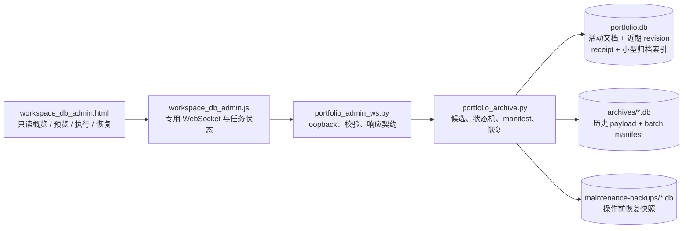

# 仓位数据库记录管理页与归档实施计划

> 状态：**已实施并合并**（phases 0-7，随 PR #24 落 main）。本文件保留为设计
> 依据与验收口径，不再是待办清单。其中 §14 对 `Rehydrate Original` 的约束
> 仍然生效且仍未实现——后端至今固定回 `'rehydrateOriginal': False`
> （`portfolio_admin_ws.py`），在该语义冻结并测试前必须保持禁用。
> 自动归档同样仍是需用户显式开启的 opt-in。
>
> 页面定位：独立的本地数据库管理页面，不加载交易工作区，不承担行情、估值或下单功能
>
> 适用后端：`ib_server.py`、`historical_server.py`
>
> 核心目标：让用户能看懂仓位库当前规模、安全地把不再需要留在活动库中的历史 JSON 迁移到独立归档库，并能验证、追踪和恢复；任何归档失败都不得造成活动数据丢失或影响交易链路。

## 1. 最终决策

采用“活动库 + 独立归档分片 + 管理页”的方案：

1. `portfolio.db` 继续是活动工作区的唯一事实来源，保存当前版本、近期版本和软删除宽限期内的数据。
2. 旧版本和超过宽限期的软删除文档迁移到独立 SQLite 归档分片，不在 `portfolio.db` 的 `workspace_revisions.payload_json` 中继续占用大体积空间。
3. 新增独立页面 `workspace_db_admin.html`，使用专用的最小 WebSocket 客户端访问后端管理协议；不复用完整交易页面脚本。
4. 页面默认只读。归档必须先生成可审阅的服务端计划，再凭短期 `planToken` 执行；不能从浏览器提交任意 SQL、数据库路径或待删除主键列表。
5. 归档采用可恢复的“复制、校验、再删除”活动库副本流程，不把跨数据库 `ATTACH` 事务当作崩溃原子性保障。
6. 首次上线只开放手动归档。只有手动流程、恢复演练和持续负载测试稳定后，才允许配置自动归档。
7. 第一版不提供永久删除归档数据。归档的含义是转移和保留，不是销毁。

建议文件布局：

```text
<platform app data>/Option Combo Simulator/
├── portfolio.db
├── portfolio.db-wal
├── portfolio.db-shm
├── install_id
├── archives/
│   ├── portfolio-archive-2026-001.db
│   ├── portfolio-archive-2027-001.db
│   └── ...
└── maintenance-backups/
    ├── pre-archive-<job-id>.db
    └── ...
```

归档按“执行归档的年份 + 分片序号”滚动，而不是按业务 payload 中的期权到期日分片。单个分片超过配置上限后创建下一片；已经封存的旧分片不再写入。

## 2. 为什么这是当前项目的合适方案

### 2.1 真正减轻活动库，而不是换一张表

把旧 JSON 从 `workspace_revisions` 移到同一个 `portfolio.db` 的另一张表，只会改变逻辑位置，不会让它离开活动数据库文件。删除原行后还会先形成 freelist，文件也不一定立即缩小。

独立归档数据库可以做到：

- 活动查询、保存、打开和版本冲突检查不扫描归档 payload；
- 活动库的 WAL、备份、启动检查和恢复时间保持可控；
- 归档分片可以单独校验、备份、封存和恢复；
- 主库回收空间后，历史 payload 不再计入活动数据库文件。

### 2.2 继续使用 SQLite，不增加服务型数据库运维

当前程序是本机单用户浏览器应用，Python 后端已经是 SQLite 的唯一所有者。为管理少量工作区和大量版本快照引入 PostgreSQL、MongoDB 或云服务，会额外带来账号、端口、网络、升级和备份运维，却不能消除归档过程本身的数据安全问题。

SQLite 分片仍可使用 Python 标准库、现有 WebSocket 通道、现有 loopback 限制和现有备份实践，改动范围更小。

### 2.3 “过期”定义为存储生命周期，不猜测业务价值

数据库管理页不得仅因某个期权已经到期，就自动判断整个工作区没有价值。到期仓位可能仍用于复盘、税务核对或策略研究。

第一版只有两类自动可判定候选：

1. 活动文档中过了版本保留线的非当前版本；
2. 已软删除且超过恢复宽限期的完整文档。

业务 payload 中的合约到期日只能作为展示和人工筛选信息，不能作为默认归档或删除依据。

### 2.4 管理面与交易面隔离

数据库管理页不需要产品注册、定价、图表、订单构建或 IB 订阅。独立页面只加载自己的 core、transport 和 UI 文件，能够降低以下风险：

- 打开管理页意外建立行情订阅；
- 管理动作卡顿交易页面事件循环；
- 管理按钮误用交易页面状态或授权；
- 为一个管理页继续扩大 `app.js` 或 `ws_client.js` 的职责。

## 3. 当前实现基线与需要先处理的约束

当前 `portfolio_store.py` 的 schema v1 包含：

- `workspace_documents`：文档索引、当前 revision 和软删除时间；
- `workspace_revisions`：每个 revision 的完整 JSON、SHA-256、save token 和保存时间；
- WAL、`synchronous=FULL`、`busy_timeout`、增量 auto-vacuum；
- 乐观 revision 锁和 save token 幂等；
- soft delete / undelete；
- verified backup 后的 revision prune；
- 有界 `incremental_vacuum`。

现有 retention 会直接删除超出“最近版本 + 近期每日锚点”规则的活动文档旧 revision。实施归档后，这条路径必须改成“归档成功后再从活动库移除”，不能同时保留另一条无归档的自动删除路径。

### 3.1 save token 不能随着 payload 一起消失

当前 save token 的唯一性由 `workspace_revisions.save_token UNIQUE` 保证，幂等重放也从这张表读取。如果旧 revision 被迁出活动库，原 token 就消失；一个延迟很久的重试可能被误判成新保存。

因此 schema 迁移必须先增加紧凑的 `workspace_save_receipts`：

```sql
CREATE TABLE workspace_save_receipts (
    save_token      TEXT PRIMARY KEY,
    document_id     TEXT NOT NULL,
    revision        INTEGER NOT NULL,
    payload_sha256  TEXT NOT NULL,
    payload_bytes   INTEGER NOT NULL,
    saved_at_utc    TEXT NOT NULL,
    operation       TEXT CHECK (operation IN ('create', 'update', 'copy')),
    result_json     TEXT NOT NULL
);
```

- 每次保存必须在同一个活动库事务中写 revision 和 receipt；
- 现有 revision 必须在 migration 中完整回填 receipt；
- 幂等查询改为读取 receipt；
- `result_json` 只保存原成功 ACK 所需的小型元数据，不保存业务 payload；
- `operation` 为以后服务端参与 create / update / copy 判定预留；当前 `99b2895` 的 operation 只存在于客户端，迁移旧数据时填 `NULL`，在协议正式发送该字段前，服务端不得凭空推断或依赖它；
- 归档或删除 `workspace_revisions` 后，receipt 仍保留；
- 同 token 不同文档或不同 hash 仍返回 `duplicate_save_token_mismatch`。

v1 数据没有保存原始成功 ACK。migration 必须按当前 `_find_save_token_replay` 的既有响应语义合成 `result_json`：字段集合与 `save_workspace` 成功结果一致，revision、saved time、hash 和 bytes 来自 revision；symbol / market mode 从 payload 派生；历史 title 无法精确重建时沿用当前文档 title，这与现有重放读取当前 document metadata 的行为一致。`idempotentReplay` 在返回时固定为 `true`，不作为历史事实写进 receipt。

回填不得在启动路径中用一个无进度的大事务扫描全库。采用带 migration journal 的可恢复批次，每批限定行数和逻辑 bytes，提交后记录游标与进度日志；全部 receipt、bytes 和唯一性验证通过后才把 `user_version` 提升到 v2。中断后从已提交游标继续，服务端在 migration 完成前保持 store unavailable，不以半迁移 schema 对外服务。

这是进入任何归档实现前的强制前置条件。

### 3.2 统计字节数必须按 UTF-8 字节计算

当前部分查询使用 `length(payload_json)`，它对 SQLite TEXT 返回字符数，不等于 UTF-8 存储字节数。中文等多字节内容会被低估。

迁移时在活动 revision 增加并回填 `payload_bytes`：

```sql
length(CAST(payload_json AS BLOB))
```

以后新保存直接写 canonical UTF-8 的实际字节数。页面上的逻辑 payload 大小、候选大小和归档 manifest 都使用同一字段。

### 3.3 释放逻辑空间不等于缩小文件

页面必须区分：

- 逻辑 payload：业务 JSON 的实际 UTF-8 字节总量；
- 已分配数据库大小：`page_count * page_size`；
- 可回收空间：`freelist_count * page_size`；
- WAL / SHM 文件大小；
- 文件系统上的活动库、归档库和安全快照大小。

归档后删除主库记录只会先增加 freelist。日常流程使用有界 incremental vacuum；全量 `VACUUM` 不作为常规按钮，因为它需要额外磁盘空间、长时间独占和更高的中断风险。

## 4. 范围与非目标

### 4.1 第一版必须完成

- 独立管理页；
- 活动库和归档库概览；
- 快速统计与手动精确统计；
- 版本归档候选预览；
- 超过宽限期的软删除文档归档预览；
- 带计划 token 和明确确认的执行；
- 进度、结果、跳过原因和错误审计；
- 归档记录分页浏览；
- hash 校验后的恢复；
- 有界空间回收；
- 两个后端的协议一致性；
- 故障注入、恢复演练与并发约束测试。

### 4.2 第一版明确不做

- 不提供任意 SQL 控制台；
- 不允许页面提交或修改文件系统路径；
- 不把归档库放进 OneDrive 等同步目录中作为活动 SQLite 文件；
- 不自动根据期权到期日归档；
- 不自动永久删除归档内容；
- 不跨机器合并活动数据库或归档数据库；
- 不在线执行全量 `VACUUM`；
- 不在一次请求中返回所有 revision 或 payload；
- 不把完整 payload 默认展示在管理页；
- 不让归档任务与 backup、prune、vacuum 并行；
- 不让管理任务失败关闭承载行情和订单监督的 WebSocket。

## 5. 目标架构



职责边界：

- `portfolio_store.py`：活动库 schema、保存幂等、统计所需的纯存储能力；
- `portfolio_archive.py`：归档库 schema、候选计算、批次状态机、复制校验、提交、恢复；
- `portfolio_maintenance.py`：跨平台 OS file lock、活动库 lease / heartbeat / fencing、job 启动恢复和统一 maintenance guard；
- `portfolio_admin_ws.py`：管理协议、loopback、请求校验、错误码、后台 job；
- `portfolio_store_ws.py`：共享 store 环境、进程内 maintenance lock 和活动库跨进程 lease；把管理动作委托给 admin 层；
- `js/workspace_db_admin_core.js`：DOM-free 的响应规范化、容量格式化、状态机和按钮可用性规则；
- `js/workspace_db_admin.js`：WebSocket、轮询、DOM 渲染和用户确认；
- `workspace_db_admin.html` / `workspace_db_admin.css`：独立页面结构和样式。

所有耗时 SQLite 操作通过后台线程运行。WebSocket handler 只进行轻量验证、创建 job 和返回状态，不能阻塞 asyncio event loop。

## 6. 活动库 schema 演进

建议将活动库升级为 schema v2，并一次完成以下结构：

### 6.1 `workspace_revisions`

新增：

```sql
payload_bytes INTEGER NOT NULL
```

保留原 `save_token UNIQUE` 作为活动行的附加防线，但不再把它当作跨归档生命周期的唯一幂等来源。

### 6.2 `workspace_save_receipts`

保存所有已提交 save token 的紧凑回执，迁移前后语义见 3.1。

receipt 是有意永久保留的小型幂等账本：第一版不参与归档、prune 或 vacuum 候选。它会随保存次数线性增长，但每次只有几百字节；这是为了保证任意延迟重试不会在 payload 归档后重复创建 revision。管理页单独展示 receipt 行数和估算 bytes，达到真实容量阈值后再另行设计压缩，不能擅自清理 token。

### 6.3 `workspace_archive_entries`

保存活动文档的历史 revision 位于哪个归档分片，不保存 payload：

```sql
CREATE TABLE workspace_archive_entries (
    document_id       TEXT NOT NULL,
    revision          INTEGER NOT NULL,
    archive_id        TEXT NOT NULL,
    archive_batch_id  TEXT NOT NULL,
    payload_sha256    TEXT NOT NULL,
    payload_bytes     INTEGER NOT NULL,
    saved_at_utc      TEXT NOT NULL,
    archived_at_utc   TEXT NOT NULL,
    PRIMARY KEY (document_id, revision)
);
```

### 6.4 `workspace_archive_tombstones`

完整软删除文档离开活动表后，保留小型身份占位：

```sql
CREATE TABLE workspace_archive_tombstones (
    document_id       TEXT PRIMARY KEY,
    title             TEXT NOT NULL,
    symbol            TEXT NOT NULL,
    market_data_mode  TEXT NOT NULL,
    last_revision     INTEGER NOT NULL,
    deleted_at_utc    TEXT NOT NULL,
    archived_at_utc   TEXT NOT NULL,
    archive_id        TEXT NOT NULL,
    archive_batch_id  TEXT NOT NULL
);
```

用途：

- 阻止归档后的 document ID 被静默重用；
- 定位完整文档归档；
- 支持审计和“恢复原身份”冲突检查；
- 不保存业务 payload。

### 6.5 `workspace_maintenance_jobs`

保存任务状态和摘要，不保存大规模候选列表：

- `job_id`、`job_type`、`status`；
- `owner_server_instance_id`、`owner_pid`、`lease_fencing_token`；
- `created_at_utc`、`started_at_utc`、`finished_at_utc`；
- `requested_policy_json`、`summary_json`；
- `error_code`、经过脱敏的 `error_message`；
- `cancel_requested`；
- `archive_batch_id`。

完整候选 manifest 存在归档分片中；页面只获得分页摘要。

任务状态包含 `interrupted` 和 `cleanup_pending`。进程初始化或第一次成功取得 maintenance lease 时，必须把 owner 不是当前 server instance 的 `queued` / `running` job 标记为 `interrupted`，不能让页面永久看到一个已经没有执行者的 running job。随后由 batch reconciler 判断：

- 无 batch 或尚未复制：原 job 结束为 interrupted，可由用户重新 preview；
- copying / failed：清理未提交残留后结束；
- copied / verified：创建新的 resume job 或要求用户确认后续做，原 job 记录 `superseded_by_job_id`；
- 主库已有 archive entry / tombstone：收敛 batch 为 `main_committed`。

### 6.6 `workspace_maintenance_lease`

进程内 `threading.Lock` 不能协调同时运行的 `ib_server.py` 和 `historical_server.py`。采用“操作系统 advisory file lock + 活动库 lease / fencing”两层跨进程门禁：file lock 提供进程存活期间的硬互斥，数据库 lease 提供可观察的 owner、过期恢复、job 归属和 fencing token。活动库增加单例 lease 表：

```sql
CREATE TABLE workspace_maintenance_lease (
    lease_name          TEXT PRIMARY KEY,
    holder_instance_id  TEXT NOT NULL,
    holder_pid          INTEGER NOT NULL,
    fencing_token       INTEGER NOT NULL,
    acquired_at_utc     TEXT NOT NULL,
    heartbeat_at_utc    TEXT NOT NULL,
    expires_at_utc      TEXT NOT NULL
);
```

- 每个后端进程启动时生成不可复用的 `server_instance_id`；
- 先取得活动库旁固定路径的 `portfolio.maintenance.lock` advisory lock，再通过活动库 `BEGIN IMMEDIATE` 原子取得或续租 lease；POSIX 使用 `fcntl`，Windows 使用 `msvcrt` 的窄封装并做双进程测试；
- 只有 lease 已过期或由同一 instance 持有时才能更新；
- 每次新持有者接管都递增 `fencing_token`；
- backup、archive、archive cleanup、原 retention 替换流程、integrity scan 和 vacuum 全部要求有效 lease；
- 每个 job / batch 记录 fencing token，在复制、verify、主库 delete 和完成标记前重新检查；失去 lease 的旧进程只能停止，不能继续产生副作用；
- 进程内 `threading.Lock` 继续作为同一进程内的第二道防线；
- 普通 save/load 不取得 maintenance lease，仍只受 SQLite 正常事务协调。

lease 过期本身不允许绕过仍被另一进程持有的 OS file lock。进程暂停时 lock 仍在，新进程只能报告 maintenance busy；进程退出或崩溃后 OS 自动释放 lock，新持有者才可接管过期 lease。这样可避免旧进程在 lease 超时后恢复执行 backup / vacuum。固定获取顺序为“进程内 lock → OS file lock → DB lease”，释放顺序相反。

### 6.7 `workspace_archives`

活动库维护归档分片注册表，概览不应每次遍历并打开 `archives/*.db`：

```sql
CREATE TABLE workspace_archives (
    archive_id              TEXT PRIMARY KEY,
    archive_schema_version  INTEGER NOT NULL,
    status                  TEXT NOT NULL,
    created_at_utc          TEXT NOT NULL,
    sealed_at_utc           TEXT,
    last_verified_at_utc    TEXT,
    last_verify_status      TEXT,
    file_bytes              INTEGER NOT NULL,
    logical_payload_bytes   INTEGER NOT NULL,
    revision_count          INTEGER NOT NULL,
    missing_since_utc       TEXT
);
```

- 创建、写入、封存和 verify 时，在持有 lease 的条件下更新注册表；
- 快速概览只读注册表；
- verify job 才打开真实分片并刷新大小、计数和状态；
- 注册表存在但文件缺失时，明确标记 `missing` 并返回 `archive_not_found`；
- 目录中出现未注册文件时只报告 orphan candidate，不自动认领或删除。

## 7. 归档分片 schema 与滚动规则

每个分片使用独立 schema version，并至少包含：

### 7.1 `archive_meta`

- `archive_id`；
- `archive_schema_version`；
- `source_install_id`；
- `created_at_utc`；
- `sealed_at_utc`；
- `part_year`、`part_number`。

### 7.2 `archive_batches`

- `batch_id`；
- 状态：`copying`、`copied`、`verified`、`main_committed`、`cancel_requested`、`cleanup_pending`、`canceled`、`failed`；
- `owner_server_instance_id` 和 `lease_fencing_token`；
- policy JSON 和 preview fingerprint；
- 文档数、revision 数、payload 字节数；
- manifest SHA-256；
- 创建、校验、提交时间；
- 来源活动库 schema version。

未封存分片还包含单例 `archive_writer_fence`，记录当前获准写入的 main-DB fencing token 和 server instance。新 holder 在触碰分片前先用归档库 `BEGIN IMMEDIATE` 提升 fence；每个 archive 写事务在同一事务内验证 token。若旧事务已经持有归档写锁，新 holder 必须等待它结束后再提升 fence并运行 reconciler；fence 提升后，旧 worker 的后续事务全部失败。封存分片不再需要 writer fence 更新，因为它只读。

### 7.3 `archived_documents`

保存文档元数据。`archive_kind` 区分：

- `partial_history`：活动文档的部分旧 revision；
- `deleted_document`：超过宽限期的完整软删除文档。

### 7.4 `archived_revisions`

字段与活动 revision 等价，并增加 `archive_batch_id`、`archived_at_utc`。约束至少包括：

- `PRIMARY KEY(document_id, revision)`；
- `UNIQUE(save_token)`；
- payload SHA-256；
- payload UTF-8 bytes；
- payload schema version。

### 7.5 分片策略

- 默认按归档执行年份写入当前分片；
- 达到 `archive_rollover_bytes` 后，新建同年份下一序号分片；
- 一个 batch 只能写入一个分片，空间不够时在 batch 开始前滚动；
- 分片封存后只读，除恢复读取和完整性检查外不再修改；
- 客户端只看到 `archiveId`，不能看到或控制真实路径；
- 主库中的 archive ID 必须能由服务端配置安全解析，禁止 `..`、绝对路径和符号链接逃逸。

### 7.6 失败或取消批次的残留规则

取消只允许发生在主库提交前。对于未封存分片中的 `failed` / `canceled` batch：

1. 在持有跨进程 lease 且 fencing token 仍有效时进入 `cleanup_pending`；
2. 删除只属于该 batch、且主库不存在 archive entry / tombstone 的 revision、document 和 manifest 行；
3. 清理完成后把 batch 留作不含 payload 的审计摘要，状态改为 `canceled` 或 `failed`；
4. safe replay 只允许复用 `copied` / `verified` / `main_committed` batch 的一致 row，绝不复用失败 batch 的 payload；
5. verify 计数和逻辑 payload 统计始终排除 failed / canceled / cleanup_pending batch；
6. 清理后可做有界 incremental vacuum，但分片滚动仍以实际分配文件 bytes 为硬上限，不能假装未回收的死页不存在；若实际文件已过上限则直接封存并滚动新分片。

分片一旦封存，不再在线清理 failed/canceled 行；封存前必须先完成 cleanup reconciler。无法安全判断归属的行会阻止封存并报告 `archive_cleanup_required`，不允许静默遗留。

## 8. 归档资格与默认策略

### 8.1 活动文档旧 revision

沿用现有保留思路：

- 永远保留 current revision；
- 保留最近 `revision_keep_recent=50` 个 revision；
- 在最近 `revision_keep_daily_days=90` 天内，对超出最近 50 的部分每天保留最后一个锚点；
- 其余非当前 revision 成为归档候选。

不变量：活动文档 current revision 在任何策略、竞态或人工选择下都不可进入归档候选。

### 8.2 软删除文档

- 默认 `archive_deleted_after_days=30`；
- 宽限期内继续留在正常 Recently Deleted，可用原有 undelete；
- 超过宽限期后，完整文档及全部剩余 revision 成为归档候选；
- 完整归档后不再出现在普通 Open / Recently Deleted，只出现在管理页归档列表。

### 8.3 手工筛选

页面可允许用户缩小系统生成的候选，例如只选择特定文档或时间范围，但不能扩大到不满足硬性安全条件的记录。服务端重新计算最终集合，不信任客户端传入的 revision ID。

### 8.4 自动归档

第一版默认：

```ini
[portfolio_store]
archive_enabled = true
archive_auto_run = false
archive_deleted_after_days = 30
revision_keep_recent = 50
revision_keep_daily_days = 90
archive_max_rows_per_batch = 500
archive_max_payload_bytes_per_batch = 67108864
archive_commit_max_rows = 25
archive_commit_max_payload_bytes = 33554432
archive_rollover_bytes = 2147483648
```

`revision_keep_recent` 和 `revision_keep_daily_days` 是现有配置键，归档直接沿用，不创建第二套 retention 真相来源。默认必须保持“可查看、可手工执行、不会自动搬移”。

## 9. 安全归档状态机

不得依赖跨两个 SQLite 文件的单一 `ATTACH` 事务。活动库使用 WAL 时，跨库提交在掉电边界上不应被当作完整原子保障。

每个 batch 按以下步骤执行：

### 9.1 预览

1. 服务端根据当前 policy 计算候选；
2. 记录每条候选的 document ID、revision、hash、bytes、保存时间和入选原因；
3. 计算 manifest hash 和活动库 generation fingerprint；
4. 返回默认 15 分钟有效的 `planToken`；
5. 页面展示数量、估算可释放字节、涉及文档和保留规则。

generation fingerprint 至少绑定：

- 活动库 install ID 和 schema version；
- 候选 manifest hash；
- 每个相关文档的 current revision / deleted timestamp；
- policy；
- 预览创建时间和随机 nonce。

`planToken` 还必须绑定发放它的 `server_instance_id`。Live backend 发出的 token 不能交给 Historical backend 执行；后端重启后旧 token 一律失效并要求重新 preview。完整 fingerprint revalidation 仍然是最终数据正确性检查，15 分钟 TTL 只是限制 token 生命周期，不替代 revalidation。

### 9.2 执行前重新验证

- token 未过期且未使用；
- policy 与预览一致；
- 候选 manifest 未变化；
- 磁盘剩余空间满足“归档副本 + 操作前恢复快照 + 安全余量”；
- 进程内 maintenance lock 和活动库跨进程 maintenance lease 均可取得；
- lease fencing token 在执行前和每个关键状态转换前保持一致；
- 当前没有 backup、archive、prune 或 vacuum job；
- 活动库和目标归档库 `quick_check` 为 `ok`。

任何一项不成立，返回 `archive_plan_stale`、`insufficient_disk_space` 或稳定错误码，不做部分删除。

### 9.3 创建操作前恢复快照

使用 SQLite backup API 生成 `maintenance-backups/pre-archive-<job-id>.db`，执行 `quick_check` 并记录 snapshot hash / 大小。即使用户没有配置 OneDrive backup 目录，这个本地恢复快照也必须存在。

同一个 preview / job 拆出的连续 batch 可以复用一份操作前全库快照，条件是它们绑定同一个 pre-mutation generation fingerprint、快照 manifest 覆盖全部候选、快照已验证、没有检测到 job 之外的相关数据变更，且复用窗口不超过 15 分钟。不同 job 或 fingerprint 不得复用。磁盘预检按“每个 job 一份快照”，而不是机械地按每个 batch 重复计算。

恢复快照 retention 使用精确的 OR 保留规则：若快照属于最新 5 个，或年龄不超过 14 天，则保留；只有“既不在最新 5 个之内，并且年龄超过 14 天”的快照才可删除。清理还要求其相关 batch 已完成并验证，当前没有 restore / reconciler 引用它。

### 9.4 复制到归档分片

- 在归档库短事务中插入 batch、document 和 revision；
- 以 `(document_id, revision)` 和 `save_token` 唯一约束保证重试幂等；
- 已存在且 hash/bytes 完全一致视为安全重放；
- 主键相同但 hash 不同视为归档冲突并停止；
- 复制阶段不删除或修改活动库 payload。

开始复制和每个归档事务提交前均检查 lease fencing token。若 lease 丢失，当前 worker 立即转 interrupted，不再提交新 row；新持有者由 reconciler 清理或接续。

### 9.5 校验归档副本

提交归档复制后必须验证：

- `PRAGMA quick_check = ok`；
- manifest 行数、总 bytes 和 document 数一致；
- 每条 payload 的 canonical UTF-8 SHA-256 与活动库一致；
- batch manifest SHA-256 一致；
- 分片元数据的 source install ID 和 schema 合法。

只有全部通过，batch 才能进入 `verified`。

### 9.6 从活动库提交移除

主库移除按候选类型使用不同事务粒度：

- 活动文档旧 revision 相互独立，按 document 再按 `archive_commit_max_rows` / `archive_commit_max_payload_bytes` 拆成多个短 `BEGIN IMMEDIATE` 事务；默认不超过 25 行或 32 MiB，任一限制先到即提交；
- 完整软删除文档的 tombstone、全部剩余 revision 删除和 document 删除必须在同一个事务中原子完成，不能把一个文档归档一半；
- 超过普通预算的完整软删除文档单独执行，页面明确标记 large-document exception，预检 WAL / 磁盘余量并记录实际锁时长；超过硬安全上限时拒绝在线提交，要求离线维护；
- archive batch 是复制、校验和审计单位，不等于主库只能使用一个删除事务。

每个短事务内逐项重新判断：

- batch 在归档库已 verified；
- 目标 row 的 hash、bytes、saved time 与 manifest 一致；
- 活动文档的 current revision 未变化；
- revision 仍非 current，或完整软删除文档仍处于删除状态且已过宽限期；
- 对应 save receipt 已存在；
- 操作前恢复快照已 verified。
- 跨进程 lease 仍由当前 instance 持有且 fencing token 与 batch 一致。

满足才插入主库 archive entry / tombstone 并删除活动 payload；发生变化的候选只记为 `skipped_changed`，不能强制删除。

完整软删除文档归档时，先写 tombstone，再删除 revision 和 document。外键 cascade 不能误删 receipts、archive entry 或 tombstone。

### 9.7 完成、回收与审计

- 把 archive batch 标记为 `main_committed`；
- 保存 copied / committed / skipped 的精确计数；
- 记录脱敏错误，不把数据库真实路径或原始 SQL 返回浏览器；
- 在 activity 空闲且 freelist 达到阈值时执行有界 incremental vacuum；
- WAL checkpoint 只采用不会强制中断活跃读写的策略；
- 页面分别展示“已从活动表移除”和“活动文件实际回收”结果，不能把两者混为一个成功数字。

### 9.8 崩溃恢复语义

- 归档复制前崩溃：活动库未变，可重试；
- 复制中崩溃：活动库未变，唯一键使复制可重放；
- verified 后、主库删除前崩溃：活动和归档各有一份，重启后可继续提交；
- 主库提交后、batch 标记完成前崩溃：主库 archive entries / tombstone 是提交证据，reconciler 将 batch 修正为完成；
- 任一阶段无法判断时 fail closed，保留恢复快照和双方数据，不自动删除。

后端启动或首次取得 maintenance lease 时还必须执行 job / batch 启动恢复：先把其他 server instance 遗留的 running job 标记为 interrupted，再按主库 entry/tombstone、归档 batch 状态和 recovery snapshot 三方证据收敛。页面查询旧 job 时必须得到 interrupted、resumed 或 completed 等终态/指向，不能永久停留在 running。

## 10. 独立管理页信息架构

### 10.1 顶部状态

- 当前连接：Live backend / Historical backend / disconnected；
- 数据库能力和 schema version；
- 最近一次统计时间；
- 当前 maintenance job；
- 最近 backup / archive / integrity check 状态；
- 醒目的只读或维护中提示。

### 10.2 概览

卡片至少展示：

- 活动文档数；
- Recently Deleted 数；
- 活动 revision 数；
- 活动 payload 逻辑大小；
- save receipt 行数与估算占用，并注明它是永久幂等账本；
- 活动 DB 已分配大小；
- 可回收大小；
- WAL / SHM 大小；
- 归档文档、revision、逻辑 payload、分片文件总大小，以及注册表最近校验时间 / missing 数；
- 最近 7 / 30 天新增 revision 和 payload bytes；
- 当前策略下候选数量和预计可从活动 payload 移出的字节。

默认概览使用已有计数字段、`payload_bytes` 和 PRAGMA，目标是快速返回。对旧库首次 migration 或用户点击“精确重新计算”时才执行全表字节校验，并在后台 job 中完成。

### 10.3 归档候选

按两组展示：

- 旧 revision；
- 过宽限期的软删除文档。

列表分页并显示标题、symbol、类型、版本范围、最后更新时间、候选数、候选 bytes、保留数和入选原因。不下载 payload。

页面动作顺序固定为：

1. 调整允许的 policy 参数；
2. `Preview Archive`；
3. 审阅服务端结果；
4. 输入明确确认文本，例如 `ARCHIVE 128 REVISIONS`；
5. `Execute`；
6. 查看进度和最终校验摘要。

预览后任何相关保存、删除、恢复或策略改变都应让执行返回 stale，要求重新预览。

### 10.4 归档库

- 分片列表：archive ID、创建/封存时间、文件大小、batch 数、revision 数、last quick check；
- batch 列表：状态、policy、计数、bytes、跳过数、manifest hash 前缀；
- 归档文档与 revision 分页搜索；
- `Verify Archive`；
- `Restore as Copy`；
- 高级 `Rehydrate Original`，仅在无身份冲突且 manifest 完整时可用。

### 10.5 维护与审计

- 最近任务及耗时；
- backup、quick check、归档、回收结果；
- 可重试失败和稳定错误码；
- 仅在安全阶段可用的 Cancel；
- 下载脱敏诊断摘要的能力可以后续增加，但不得包含 payload 和本机路径。

## 11. 页面交互约束

- 页面首次加载只请求 capability 和快速概览，不自动执行精确扫描或归档；
- destructive-looking 动作必须显示其实际含义和可恢复点；
- copy / verify 阶段允许请求取消，进入主库提交阶段后不再提供取消按钮；
- 关闭页面不取消后端 job，重新打开可凭 job ID 查看；
- 断线后页面只能重连并查询 job，不能盲目再次 execute；
- 一个浏览器请求超时不能被显示为归档失败，必须先查 job 状态；
- 任何统计字段缺失都显示 unavailable，不用 0 掩盖错误；
- bytes 同时提供人类可读值和精确整数详情；
- 列表必须分页，服务端限制 page size；
- 归档页面默认不渲染 payload 内容，恢复前也不需要下载 payload 到浏览器。

## 12. WebSocket 管理协议

建议新增动作：

| Client action | Server response | 作用 |
|---|---|---|
| `request_workspace_admin_status` | `workspace_admin_status` | capability、schema、配置和当前 job |
| `request_workspace_storage_stats` | `workspace_storage_stats` | 快速或精确统计 |
| `preview_workspace_archive` | `workspace_archive_previewed` | 生成候选 manifest 和短期 plan token |
| `execute_workspace_archive` | `workspace_archive_started` | 消耗 plan token，创建后台 job |
| `get_workspace_maintenance_job` | `workspace_maintenance_job` | 轮询进度和结果 |
| `cancel_workspace_maintenance_job` | `workspace_maintenance_cancel_requested` | 仅安全阶段请求取消 |
| `list_workspace_archive_batches` | `workspace_archive_batches_list` | 分页列 batch |
| `list_archived_workspaces` | `archived_workspaces_list` | 分页列归档文档 / revision 摘要 |
| `verify_workspace_archive` | `workspace_archive_verify_started` | 后台完整性校验 |
| `restore_archived_workspace` | `workspace_archive_restore_started` | 恢复为副本或原身份 |
| `request_workspace_space_reclaim` | `workspace_space_reclaim_started` | 仅有界 incremental vacuum |

共同约束：

- 与现有 persistence 一样先检查 loopback，再惰性打开数据库；
- request ID 必须回显；
- 所有失败使用稳定 code，不泄漏 SQL、路径或 payload；
- 未知 action 不由管理层吞掉；
- action、mode、sort、page size、policy 均使用 allowlist / 上下界；
- 管理请求不得超过现有 WebSocket 消息上限；候选明细必须分页；
- job 创建 ACK 与 job 最终成功是两个不同状态；
- 同一 `planToken` 只能消费一次；重复 execute 返回原 job ID 或稳定的 `plan_already_consumed`，不能创建第二个 job。

建议稳定错误码至少包含：

- `admin_unavailable`；
- `archive_disabled`；
- `archive_plan_stale`；
- `archive_plan_expired`；
- `archive_plan_already_consumed`；
- `maintenance_busy`；
- `insufficient_disk_space`；
- `archive_copy_failed`；
- `archive_verification_failed`；
- `archive_conflict`；
- `archive_not_found`；
- `archive_corrupt`；
- `archive_cleanup_required`；
- `restore_conflict`；
- `unsafe_reclaim_refused`。

## 13. 恢复语义

### 13.1 恢复活动文档的归档旧 revision

1. 根据主库 archive entry 定位分片；
2. 对分片执行 quick check 或确认最近有效校验；
3. 读取 payload 并验证 bytes、SHA-256 和 schema；
4. 通过正常 `save_workspace` 路径复制为活动文档的新 revision；
5. 使用新的 save token 和调用时的 expected current revision；
6. 不重写旧 revision 号，不把 current pointer 倒退。

这样恢复仍受现有冲突检查、payload 校验和交易安全加载语义保护。

### 13.2 恢复完整软删除文档

提供两种模式：

- `Restore as Copy`：默认。生成新 document ID，从归档 current payload 创建 revision 1，标题注明恢复来源；原 tombstone 保留。
- `Rehydrate Original`：高级。只有原 document ID 在活动表中不存在、tombstone 与 archive manifest 完全匹配、所有 revision 均通过校验时才允许。恢复后删除 tombstone，但 receipts 不重复写、不改变原 token 归属。

第一版可以先交付 `Restore as Copy`，再在独立阶段增加原身份恢复；不得用未经测试的原身份恢复阻塞安全归档主流程。

`Rehydrate Original` 上线前必须冻结“恢复后再次归档”的语义：恢复时保留原 archive entries，并把重新写回活动库的历史 revision 标记为 `rehydrated_from_archive`。以后这些 revision 再满足 retention 时，不创建第二份 archive row；服务端根据现有 entry 定位原分片，重新校验 hash / bytes / save token 完全相同后，直接从活动库移除 rehydrated 副本。任何不一致均返回 archive conflict，不能覆盖封存分片或改绑 batch。该规则未实现和测试前，`Rehydrate Original` 必须保持禁用。

## 14. 并发与性能约束

### 14.1 跨进程 lease 与进程内 mutex

`ib_server.py` 和 `historical_server.py` 默认解析到同一个活动库，可能同时运行。现有 `portfolio_store_ws.py` 的 `threading.Lock` 只负责单进程互斥，不是正确性边界。

统一顺序是：先取得本进程 `threading.Lock`，再取得 OS advisory file lock，最后通过活动库取得 `workspace_maintenance_lease`；执行期间定期 heartbeat，并在每次外部副作用前检查 fencing token。写未封存归档分片时还要在该分片事务中验证 `archive_writer_fence`。backup、archive、archive cleanup、原 retention 替换逻辑、integrity scan 和 vacuum 必须使用同一 lock path 和 lease name；任何功能都不能私建一套锁或绕过它。

lease 到期只允许新持有者接管，不代表旧 worker 可以继续。fencing token 是防止暂停进程复活后写入的最终门禁。锁获取顺序固定，避免两个后端形成反向等待。

### 14.2 缩短活动库写锁

- 候选计算、复制、hash 校验在活动库读事务或无事务阶段完成；
- 只有最终 revalidate + entry/tombstone + delete 使用 `BEGIN IMMEDIATE`；
- 归档 batch 限制复制和验证规模，主库 commit chunk 另用更小的 rows / bytes 双上限；
- 活动旧 revision 按文档和 commit chunk 多事务提交，不能让 64 MiB batch 形成一个巨大 WAL 事务；
- 完整软删除文档不能跨 batch 拆一半提交；若单文档超过 batch 上限，该 batch 单独处理该文档并明确展示。

### 14.3 不影响交易连接

- 管理页使用独立 WebSocket；
- 两个后端都把同步数据库工作放入线程；
- 任何管理异常都由 handler 捕获；
- 压力测试必须同时运行持续 save/load 和模拟市场消息，确认 event loop 延迟、socket 存活和 order supervision 不受明显影响。

### 14.4 性能预算

第一版验收目标：

- 快速概览在 10,000 revisions / 1,000 documents 的测试库上 P95 小于 500 ms；
- 普通分页列表 P95 小于 500 ms；
- preview P95 小于 2 s，超出则自动转后台 job；
- 普通旧 revision commit chunk 的主库写锁 P95 小于 1 s；完整软删除大文档作为单独例外统计，不能混入后掩盖；
- 管理任务期间正常小型 workspace save 不出现超过 `busy_timeout` 的持续失败；
- event loop 心跳额外延迟 P95 小于 100 ms。

数值在真实 macOS / Windows 基准后可调整，但不能取消预算和回归测试。

## 15. 配置、路径与备份

建议新增配置：

```ini
[portfolio_store]
archive_enabled = true
archive_dir =
archive_auto_run = false
archive_deleted_after_days = 30
archive_max_rows_per_batch = 500
archive_max_payload_bytes_per_batch = 67108864
archive_commit_max_rows = 25
archive_commit_max_payload_bytes = 33554432
archive_rollover_bytes = 2147483648
archive_plan_ttl_seconds = 900
archive_recovery_snapshot_keep = 5
archive_recovery_snapshot_keep_days = 14
archive_recovery_snapshot_reuse_seconds = 900
maintenance_lease_ttl_seconds = 60
maintenance_lease_heartbeat_seconds = 15
```

继续复用现有：

```ini
revision_keep_recent = 50
revision_keep_daily_days = 90
vacuum_freelist_pages = 256
vacuum_max_pages = 512
```

不得新增 `archive_vacuum_*` 同义键。活动库和未封存归档分片执行有界回收时共用现有 vacuum 阈值；若未来真实基准证明两类库必须不同，再通过独立 migration / 文档评审引入，而不是第一版预设两个真相来源。

路径优先级沿用当前模式：环境变量 > config > platform app-data 默认目录。

安全要求：

- 活动库、归档库和 WAL/SHM 都位于本机应用数据目录；
- OneDrive 只接收 SQLite backup API 生成且 quick-check 通过的静态快照；
- 不用文件复制直接备份活跃 WAL 数据库；
- 归档分片也应有静态备份发布策略，文件名带 install ID 和 archive ID；
- 两台机器写同一同步目录时只能发布各自命名的静态备份，不能共同打开同一归档库；
- 页面只显示逻辑位置标签，不显示用户主目录绝对路径。

## 16. 分阶段实施与约束测试

以下阶段必须按顺序完成。每个阶段的成功门槛是进入下一阶段的硬条件，不允许以“人工看起来正常”替代自动测试。

### 阶段 0：冻结语义并建立可测基线

实施：

1. 建立已知数据夹具：活动文档、软删除文档、跨日 revision、ASCII / 中文 payload、不同 payload 大小；
2. 记录现有 save/load/delete/undelete/restore/prune/backup 行为；
3. 明确旧 revision 和软删除文档候选规则；
4. 冻结容量指标名称及计算公式；
5. 明确自动归档默认关闭。

约束测试：

- 给定固定时钟和 revision 序列，候选集合完全确定；
- current revision 永远不在旧版本候选中；
- 未超过 30 天的软删除文档不在完整归档候选中；
- payload 中期权已到期但文档仍活跃时，不因业务到期日自动成为完整文档候选；
- 中文 JSON 的 `payload_bytes` 等于 canonical UTF-8 实际长度；
- 基线全套 Node / Python 测试通过。

进入阶段 1 的成功标准：候选规则和统计公式已有纯函数/存储单测，现有行为无回归，评审中不存在未决的数据生命周期定义。

### 阶段 1：活动库 schema v2 与幂等回执

实施：

1. 增加正式的 v1 -> v2 migration，不把已有 v1 数据库当作 foreign DB；
2. 增加并回填 `payload_bytes`；
3. 创建并回填 `workspace_save_receipts`；
4. 创建 archive entries、tombstones、archive registry、jobs 和跨进程 maintenance lease 表；
5. 新保存事务同时写 revision 与 receipt；
6. 幂等重放改读 receipt；
7. receipt migration 使用可恢复的分批回填、进度 journal 和日志；
8. migration 前创建并验证备份，失败时保留原库。

约束测试：

- v1 fixture 原地升级后每个 revision 都有一条匹配 receipt；
- 合成 receipt 的字段集合与正常 save ACK 一致；历史 title 使用已写明的 current-document 回放语义，operation 为 `NULL`；
- 10,000 revisions 回填被拆成多个受限事务，中断后从 journal 游标续做，完成前 store 不对外可用；
- v2 initialize 可重复执行且不重复回填；
- migration 中途故障后重新运行可恢复，或明确 fail closed，不能留下被当作成功的半迁移库；
- 较新未知 schema 仍拒绝打开；
- corrupt DB 不被覆盖或重建；
- 新 save 的 revision 和 receipt 要么同时存在，要么都不存在；
- 归档模拟删除 revision 后，相同 token + 相同 hash 仍返回原 revision 的 idempotent ACK；
- 相同 token + 不同 hash 或 document ID 仍被拒绝；
- receipts 与 archive registry / tombstone 没有会被 document 删除误触发的 cascade 外键；
- 现有 save/load/conflict/soft-delete/backup 测试全部通过。

进入阶段 2 的成功标准：在不实现归档的前提下，删除任意非当前 revision payload 都不会破坏 save-token 幂等语义，v1 真实副本升级和恢复演练成功。

### 阶段 2：只读统计服务与独立页面骨架

实施：

1. 实现快速 stats 和后台 exact stats；
2. 实现 admin capability、分页和稳定错误码；
3. 新建独立 HTML / CSS / core / page scripts；
4. 同时接入 Live 和 Historical backend；
5. 页面只提供概览和不可执行的候选预览骨架。
6. 快速归档概览只查询主库 `workspace_archives` 注册表，真实分片只由 verify job 打开。

约束测试：

- active/deleted/revision 数与直接 SQL fixture 一致；
- logical bytes、allocated bytes、freelist bytes、WAL bytes 不混淆；
- 精确 stats 对 Unicode payload 计算正确；
- 10,000 revision fixture 达到快速概览预算；
- page size 超限、非法 sort/filter 被拒绝；
- 非 loopback 请求在惰性打开 DB 前被拒绝；
- 响应不包含 DB path、SQL 或 payload；
- 注册表有分片但文件被移走时显示 missing / `archive_not_found`，目录中未注册文件只报告不自动认领；
- 两个后端对同一请求返回相同 shape 和 code；
- 管理页脚本清单不包含订单、行情、估值和交易 app scripts；
- 管理页断线、超时和 unavailable 状态有明确 UI；
- `tests/run.js` 纳入新的 core/page suite。

进入阶段 3 的成功标准：用户可在独立页面准确看见容量和候选摘要，页面没有任何写操作，两个后端协议完全一致。

### 阶段 3：归档分片与 copy-only 批次

实施：

1. 实现归档路径解析、分片创建和 schema；
2. 实现 preview manifest、plan token 和过期校验；
3. 实现 recovery snapshot；
4. 实现 copy-only job、幂等重放和完整校验；
5. 实现跨进程 lease、heartbeat、fencing token 和进程内锁的固定获取顺序；
6. 把现有 scheduled backup 和有界 vacuum 维护路径接入同一 maintenance guard；guard 上线后不得残留任何只受进程内锁保护的维护入口；OS lock 采用与现有 backup 相同的非阻塞抢占，抢不到即返回 `maintenance_busy`；
7. 实现 failed / canceled batch cleanup；
8. 本阶段明确不从活动库删除任何 row。

约束测试：

- 同一 manifest 重试不会重复插入或改变数据；
- 主键相同 hash 不同立即失败；
- 复制后每条 payload hash/bytes 与活动库一致；
- archive quick check、计数和 manifest hash 全部验证；
- 模拟磁盘满、只读目录、权限错误、写入中断、归档损坏时活动库逐字节不变；
- token 过期、重复消费、policy 改变和相关文档新保存均拒绝执行；
- token 绑定 server instance；跨后端提交和后端重启后提交均失效并要求重新 preview；
- 两个独立进程同时争抢 maintenance 时只有一个能同时持有 OS lock 和 lease，另一方得到 `maintenance_busy`；
- 现有 scheduled backup / vacuum 与归档任务经由同一 guard 互斥，代码中不存在绕过 guard 的维护调用点；
- 人工暂停旧 holder 直到 lease 过期时，因为 OS lock 仍被持有，新进程仍不能接管；
- 模拟旧进程崩溃释放 OS lock 后，新进程可接管过期 lease 并取得更大的 fencing token；使用旧 token 的模拟 worker 不能继续 copy / verify / delete；
- 客户端构造 archive ID / path traversal 无法影响服务端路径；
- batch 超过行数或 bytes 上限时按完整文档边界拆分；
- copy 中取消或失败后，未封存分片的 batch payload 被 cleanup；verify / stats 不计死 batch，safe replay 不复用其 row；
- 清理产生 freelist 且实际分片仍超过 rollover 上限时会滚动新分片，不按虚假逻辑 bytes 继续写；
- recovery snapshot 可由现有 restore 工具或专用测试成功恢复。

进入阶段 4 的成功标准：在故障注入矩阵中，归档副本要么完整 verified，要么活动库保持唯一有效副本；没有任何活动 row 被删除。

### 阶段 4：verified 后提交主库移除与空间回收

实施：

1. 用 archive-then-prune 替换现有直接 retention delete；
2. 实现最终 revalidation、archive entry / tombstone 和活动 row 删除；
3. 实现崩溃 reconciler；
4. 实现有界 incremental vacuum；
5. 将旧 revision 的主库提交拆成受 rows / bytes 双上限约束的 commit chunks；
6. 展示 logical removed、freelist increase 和 physical reclaimed 三类结果。

约束测试：

- 未 verified archive 或缺少 verified recovery snapshot 时，主库 DELETE 路径不可达；
- current revision 在所有故障和竞态下均保留；
- preview 后文档发生保存时，旧 manifest 对该文档跳过或整体 stale，不误删；
- preview 后软删除文档被 undelete 时不归档完整文档；
- archive entry / tombstone 与实际删除在同一主库事务中；
- 500 行 / 64 MiB archive batch 会拆成多个不超过 25 行 / 32 MiB 的旧 revision commit 事务；
- 完整软删除文档仍保持单文档原子提交，超硬上限时拒绝在线处理；
- receipts 不因 revision / document 删除而 cascade；
- 在“复制前、复制提交后、校验后、主库事务中、主库提交后、batch 完成标记前”逐点注入崩溃，重启后无数据丢失且状态可收敛；
- 归档后活动 payload bytes 按 manifest 精确下降；
- freelist 上升符合页粒度预期；
- 有界 vacuum 不超过配置页数，执行后 quick check 仍为 ok；
- 多次运行同一 policy 最终无候选且结果幂等；
- 同一 preview/job 的连续 batches 只生成一份满足复用条件的 recovery snapshot；不同 fingerprint 不复用；
- snapshot retention 只删除“非最新 5 个且年龄超过 14 天”的无引用快照；
- 原 `prune_revisions` 不再存在可绕过归档的定时调用。

进入阶段 5 的成功标准：所有 fault boundary 都能证明至少保留一份 verified payload，且活动库只在安全证据齐备后移除副本。

### 阶段 5：完整管理页写操作与任务 UX

实施：

1. 接入 preview、确认、execute、轮询和重连恢复；
2. 实现任务历史、batch / archive 分页；
3. 实现安全阶段取消；
4. 对 stale、busy、disk full、verify failure 提供明确动作建议；
5. 增加 compact/reclaim 的受限入口；
6. 实现后端重启后的 orphan job 标记和 batch reconciler 指向。

约束测试：

- 未 preview 不能 execute；
- 确认文本不匹配不能 execute；
- plan token 不出现在 URL、localStorage 或日志；
- execute ACK 丢失后重连查询返回同一 job，不产生第二个 batch；
- 页面关闭后任务继续，重开能恢复进度；
- 后端进程退出后旧 running job 转为 interrupted；页面能看到 resumed / superseded / completed 指向，不会永久 running；
- 进入主库提交阶段后 Cancel disabled；
- error 不能被显示成 0 rows success；
- 所有表格 pagination、empty、loading、partial failure 状态可测试；
- 键盘操作、焦点、颜色对比和窄屏布局可用；
- 页面没有任何下单、IB connect、API stream reset 或行情订阅动作；
- Live socket 上管理请求失败不会关闭连接；独立管理 socket 关闭也不影响交易页面。

进入阶段 6 的成功标准：用户能够在不理解 SQLite 细节的情况下完成一次有证据的归档，并准确分辨归档完成与磁盘空间已回收。

### 阶段 6：归档恢复

实施：

1. 先实现活动文档旧 revision 恢复为新 revision；
2. 实现完整文档 `Restore as Copy`；
3. 完成严格冲突测试后再实现 `Rehydrate Original`；
4. 在页面展示恢复来源和结果 document / revision。

约束测试：

- 旧 revision 恢复只生成新的 head，不重写历史；
- expected revision stale 时恢复冲突且活动文档不变；
- archive hash、bytes、schema 任一不符均拒绝恢复；
- `Restore as Copy` 使用新 document ID，不覆盖同名或同 symbol 文档；
- 原身份恢复遇到活动 ID 或 tombstone 不匹配时 fail closed；
- 原身份恢复后的历史 revision 保留原 archive entry；再次 retention 时只在 hash/bytes/token 一致后删除活动副本，不复制或改写封存分片；
- 恢复后通过正常 load 路径得到 canonical 相同 payload；
- 恢复后的工作区仍执行现有交易安全 disarm 规则；
- 保存 token receipt 仍唯一，无重复 token 或 revision；
- 从静态 archive backup 还原分片后也能完成恢复演练。

进入阶段 7 的成功标准：任一已归档 payload 均能在 corruption 检查通过后恢复，且恢复不会绕过 revision 冲突或交易安全边界。

### 阶段 7：耐久性、跨平台与可选自动化

实施：

1. 建立 1,000 documents / 10,000+ revisions 的长期 fixture；
2. 并发运行保存、列表、归档、backup 和模拟市场消息；
3. 在 macOS 和 Windows launcher 环境 smoke test；
4. 完成活动库 + archive 分片 + recovery snapshot 的整套灾难恢复演练；
5. 更新 README、ARCHITECTURE、DEV_HANDOVER；
6. 满足所有门槛后，才允许用户显式开启低频自动归档。

约束测试：

- 连续重复归档 100 个 batch 无 orphan、duplicate 或未收敛 job；
- 随机进程终止 / 重启测试无 payload 丢失；
- 同时启动 Live 和 Historical 两个真实后端进程，证明 backup/archive/vacuum 由 OS lock + DB lease 跨进程互斥，崩溃接管后的旧 fencing token 失效；
- save/load 延迟和 event loop 心跳满足性能预算；
- 进程内 lock + 活动库 lease 证明同进程及跨进程的 backup/archive/vacuum 从不重叠；
- 活动库 quick check、所有归档分片 quick check 均为 ok；
- 备份恢复到空机器后，活动文档可打开、归档历史可搜索和恢复；
- Windows 路径、文件锁和 Python resolution 流程通过；
- OneDrive 目录中只有完成并验证的静态快照，没有 live WAL/SHM；
- 自动归档关停、失败退避、重启续查和磁盘低水位保护均通过；
- 全套 Node / Python 测试和人工端到端矩阵通过。

完成标准：手动模式稳定运行至少一个发布周期并完成恢复演练；自动归档仍是显式 opt-in，任何自动失败只告警、不阻止正常保存。

## 17. 测试文件与验证命令规划

建议新增：

- `tests/portfolio_store_migration_test.py`；
- `tests/portfolio_maintenance_lease_test.py`；
- `tests/portfolio_archive_test.py`；
- `tests/portfolio_archive_fault_injection_test.py`；
- `tests/portfolio_admin_ws_test.py`；
- `tests/workspace_db_admin_core.test.js`；
- `tests/workspace_db_admin_page.test.js`；
- `tests/workspace_db_admin_e2e_test.py` 或等价本地浏览器 smoke harness。

需要扩展：

- `tests/portfolio_store_test.py`；
- `tests/portfolio_store_ws_test.py`；
- `tests/ib_server_ws_test.py`；
- `tests/run.js`；
- 现有 asset version / page capability 测试。

验证命令：

```text
node tests/run.js
<project-resolved-python> -m unittest discover -s tests -p "*_test.py"
```

Windows 必须使用 `powershell_scripts/resolve_python.ps1` 或启动器解析出的解释器；macOS / POSIX 沿用项目 launcher 的解析顺序，不假设裸 `python` 可用。

人工端到端矩阵：

| 场景 | macOS | Windows | Live backend | Historical backend |
|---|---:|---:|---:|---:|
| 快速 / 精确统计 | ✓ | ✓ | ✓ | ✓ |
| 预览但不执行 | ✓ | ✓ | ✓ | ✓ |
| 旧 revision 归档 | ✓ | ✓ | ✓ | ✓ |
| 软删除完整文档归档 | ✓ | ✓ | ✓ | ✓ |
| ACK 丢失后重连续查 | ✓ | ✓ | ✓ | ✓ |
| stale plan / 并发保存 | ✓ | ✓ | ✓ | ✓ |
| 磁盘不足 / archive 损坏 | ✓ | ✓ | ✓ | ✓ |
| 有界空间回收 | ✓ | ✓ | ✓ | ✓ |
| 恢复 revision / 文档副本 | ✓ | ✓ | ✓ | ✓ |
| 活动库与归档灾难恢复 | ✓ | ✓ | ✓ | ✓ |
| 管理任务期间交易 socket 保持 | ✓ | ✓ | ✓ | — |

## 18. 预期改动文件

新增：

- `workspace_db_admin.html`；
- `workspace_db_admin.css`；
- `js/workspace_db_admin_core.js`；
- `js/workspace_db_admin.js`；
- `portfolio_archive.py`；
- `portfolio_maintenance.py`；
- `portfolio_admin_ws.py`；
- 本计划第 17 节列出的测试文件；
- 如需要，归档静态备份 / 校验的窄职责脚本。

修改：

- `portfolio_store.py`；
- `portfolio_store_ws.py`；
- `ib_server.py` / `ib_server_ws.py`；
- `historical_server.py`；
- `config.ini`；
- `tests/run.js` 和相关协议测试；
- `README.md`；
- `ARCHITECTURE.md`；
- `DEV_HANDOVER.md`；
- 如页面入口需要启动器提示，修改对应 macOS / Windows 启动文档，但不新增数据库进程。

不应修改交易业务状态结构，也不应把管理逻辑加入 `js/app.js`、订单模块或估值模块。

## 19. 上线与回滚

### 19.1 上线顺序

1. schema v2 + receipts 上线，但不开归档；
2. 只读统计页面上线；
3. copy-only shadow 模式上线，比较 manifest，不删活动数据；
4. 手动 archive commit 上线，默认小 batch；
5. restore 上线并完成真实恢复演练；
6. 稳定一个发布周期后再考虑 opt-in 自动归档。

### 19.2 回滚原则

- 不对已升级 schema 做破坏性 down migration；
- 旧代码不认识新 schema 时应拒绝打开，而不是重建数据库；
- 前端管理页可下线，活动 Save/Open 仍应正常；
- archive commit 出现疑问时停止新任务，保留活动库、归档和 recovery snapshot，由 reconciler 或恢复工具处理；
- 回滚不得删除归档分片、tombstone、receipt 或维护快照；
- 恢复活动库必须在后端停止时执行，并在安装前后分别 quick check。

## 20. Definition of Done

只有同时满足以下条件，数据库记录管理页和归档功能才算完成：

- 用户能在独立页面看见活动库、WAL、可回收空间、归档库和增长趋势；
- 统计明确区分逻辑 bytes、分配 bytes、freelist bytes 和实际文件 bytes；
- 活动库永远保留所有 current revisions；
- 旧 revision 和过宽限期软删除文档只在独立归档副本、manifest 和 recovery snapshot 全部验证后才从活动库移除；
- 任意规定的崩溃点都至少保留一份可验证 payload，重启后状态可收敛；
- save token 幂等在 payload 归档后仍成立；
- receipts 明确作为永久幂等账本，不参与自动归档或清理；管理页能单独观察其增长；
- 同时运行的 Live / Historical 后端通过 OS advisory lock、活动库 lease 和 fencing token 实现跨进程 maintenance 互斥，失去 lease 的旧进程不能继续写归档或删除主库 row；
- 后端重启后没有永久 running 的孤儿 job，interrupted job 和 batch 都能被明确收敛或重新发起；
- 主库不再存在绕过归档的自动 prune 删除路径；
- 旧 revision 使用受 rows / bytes 双上限约束的短 commit transactions，完整软删除文档的原子性例外有硬上限和单独性能记录；
- failed / canceled batch 在未封存分片中可安全清理，不参与 verify 或逻辑统计，也不会被后续 safe replay 误认领；
- 归档后活动 payload 逻辑大小按 manifest 精确下降，并能在有界回收后观察到可解释的文件空间变化；
- 已归档 revision 可恢复为新 revision，完整文档至少可恢复为副本；
- 管理页不能执行 SQL、控制路径、读取默认 payload 或触发交易动作；
- 管理失败不关闭交易 WebSocket，不阻止行情、回放、保存或后端启动；
- Live 和 Historical backend 的管理协议、权限和错误码一致；
- 活动库、归档分片和静态备份均通过 quick check，灾难恢复演练成功；
- 自动归档默认关闭，只有手动流程通过一个发布周期后才可 opt-in；
- Node、Python、故障注入、性能、macOS、Windows 和人工端到端测试全部通过；
- README、ARCHITECTURE、DEV_HANDOVER 与最终实现一致。

达到这些条件后，`portfolio.db` 只承担高频活动数据和小型生命周期索引，历史大体积 JSON 被安全地转移到可校验、可恢复、可分片管理的归档层，数据库不会因长期保存历史版本而无限拖慢日常工作区操作。
