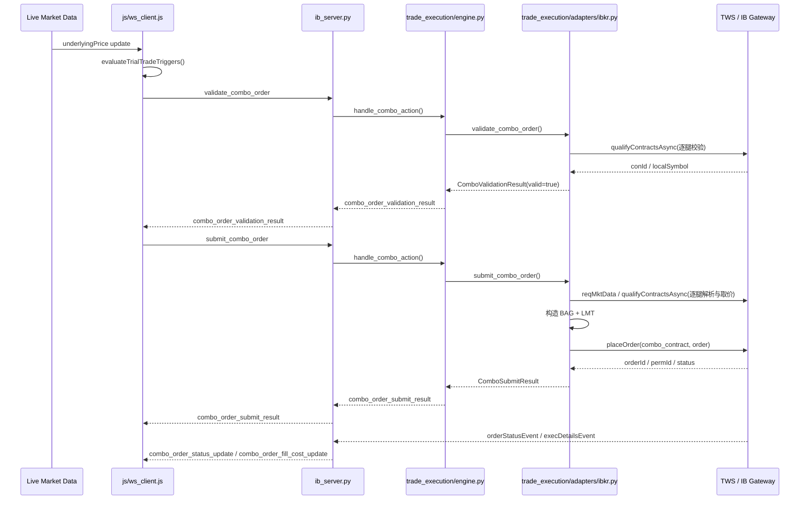
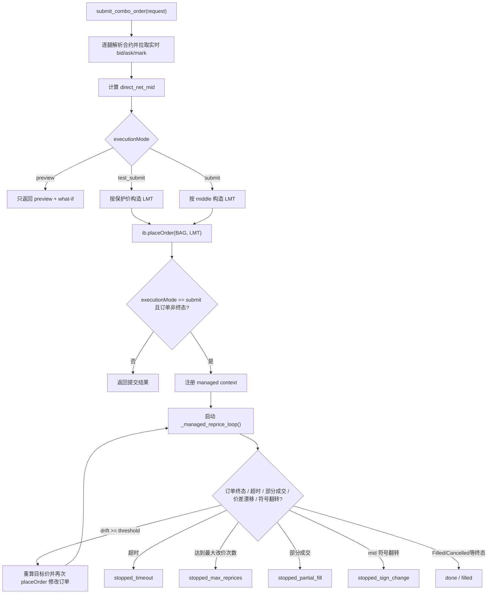
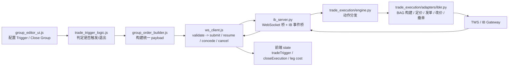

# TWS 真实下单链路 Review

本文只聚焦“会真实影响 TWS 订单状态”的代码路径，不覆盖普通行情订阅、估值算法和 UI 展示细节。

## 1. 先给结论

- 工程里真正会向 TWS 发单的统一后端入口只有一个：`trade_execution/adapters/ibkr.py` 的 `submit_combo_order()`。
- 但真实影响 TWS 订单状态的调用不止初始发单，还包括：
  - 首次下单：`ib.placeOrder(combo_contract, order)`
  - 自动改价：`_managed_reprice_loop()` 里再次 `ib.placeOrder(...)`
  - 手动让价：`concede_managed_combo_order()` 里再次 `ib.placeOrder(...)`
  - 撤单：`cancel_managed_combo_order()` 里 `ib.cancelOrder(order)`
- 前端有两条会走到真实下单的业务路径：
  - Trial Trigger 触发开仓
  - Active Group 的 Close Group 反向平仓
- `test_submit` 也会真实发到 TWS，只是价格被故意设成极难成交的保护价。
- `submit` 才会进入“受管订单”模式，并启动后端自动盯盘改价；`test_submit` 不会。

## 2. 涉及模块与职责

| 模块 | 角色 | 和真实下单的关系 |
| --- | --- | --- |
| `js/group_editor_ui.js` | 配置入口 | 让用户设置 Trial Trigger / Close Group 的执行模式、改价阈值、TIF |
| `js/trade_trigger_logic.js` | 触发规则 | 判断何时触发开仓、何时触发 exit 条件取消 live order |
| `js/group_order_builder.js` | 请求构造器 | 把 group legs 转成统一下单 payload，区分 `open` / `close` |
| `js/ws_client.js` | 前端运行时总线 | 真正发 WebSocket 请求；先 validate，再 submit；接收 status/fill 回报并写回 state |
| `trade_execution/models.py` | 后端 DTO | 统一承接前端 payload，并定义 preview/validation/result 的返回结构 |
| `trade_execution/engine.py` | 后端动作路由 | 根据 action 分发到 adapter：validate / preview / submit / resume / concede / cancel |
| `trade_execution/adapters/ibkr.py` | 核心执行器 | 合约解析、行情取价、BAG 构单、what-if、真实 placeOrder、自动改价、撤单 |
| `ib_server.py` | WebSocket + IB 事件桥 | 接前端消息、调用 execution engine，并把 TWS 状态/分腿成交回推给前端 |

## 3. 会真实触发 TWS 的入口

### A. Trial Trigger 开仓

1. `ws_client.js` 在收到 underlying 实时价后执行 `evaluateTrialTradeTriggers()`
2. 命中阈值后调用 `_requestTrialGroupComboOrder(group)`
3. 若 execution mode 是 `submit` / `test_submit`：
   - 先发 `validate_combo_order`
   - 验证通过后再发 `submit_combo_order`
4. 后端 `ExecutionEngine.handle_combo_action()` 调到 `IbkrExecutionAdapter.submit_combo_order()`
5. adapter 构建 `BAG + LMT` 并执行 `ib.placeOrder(...)`

### B. Close Group 平仓

1. `group_editor_ui.js` 点击 Close Group 按钮
2. `ws_client.js` 执行 `requestCloseGroupComboOrder(group)`
3. 若 execution mode 是 `submit` / `test_submit`：
   - 先发 `validate_combo_order`
   - 验证通过后再发 `submit_combo_order`
4. 后端仍复用同一个 adapter，只是 payload 里的 `executionIntent = close`
5. 下单结果和后续状态会被路由回 `closeExecution` 运行态

## 4. 前端到 TWS 的时序图

## 5. 后端真实下单与受管订单生命周期

## 6. 真实 TWS 行为在代码里的落点

### 6.1 首次真实发单

- 文件：`trade_execution/adapters/ibkr.py`
- 位置：`submit_combo_order()`
- 行为：
  - 基于组合净 mid 决定 `order.action` 是 `BUY` 还是 `SELL`
  - 构造 `Contract(secType='BAG')`
  - 构造 `Order(orderType='LMT')`
  - 执行 `self.ib.placeOrder(combo_contract, order)`

### 6.2 自动改价

- 文件：`trade_execution/adapters/ibkr.py`
- 位置：`_managed_reprice_loop()`
- 条件：
  - 仅 `execution_mode == 'submit'`
  - 非终态
  - 未超时
  - 未部分成交
  - 最新组合方向未翻转
  - 漂移量超过阈值
- 行为：
  - 重新计算 live combo mid / best / worst
  - 更新 `order.lmtPrice`
  - 再次 `self.ib.placeOrder(context['comboContract'], order)`，实质上是修改现有订单

### 6.3 手动让价

- 文件：`trade_execution/adapters/ibkr.py`
- 位置：`concede_managed_combo_order()`
- 行为：
  - 用户给一个 concession ratio
  - 目标价从 mid 向 worst 方向让一步
  - 再次 `placeOrder(...)` 修改 live order
  - 继续回到 managed 监控循环

### 6.4 撤单

- 文件：`trade_execution/adapters/ibkr.py`
- 位置：`cancel_managed_combo_order()`
- 行为：
  - 更新 managedState 为 `cancelling`
  - `self.ib.cancelOrder(order)`
- 触发来源：
  - 用户手动点击取消
  - Trial Trigger 的 exit condition 命中后自动取消

## 7. 下单价格是怎么定的

### `submit`

- 价格来源是组合净 middle：每条腿用 live mark，按目标方向加总成 `direct_net_mid`
- 最终价格取绝对值，再按最小价位做量化：
  - `BUY` 向下取整
  - `SELL` 向上取整

### `test_submit`

- 也是真单，但价格故意做成保护价
- `BUY`：远低于组合中间价
- `SELL`：远高于组合中间价
- 目标是把订单真实送到 TWS，方便人工检查结构，但尽量避免成交

## 8. 状态与消息如何回到前端

### 8.1 提交结果

- `ExecutionEngine` 返回：
  - `combo_order_submit_result`
  - 或 `combo_order_preview_result`
  - 或 `combo_order_validation_result`

### 8.2 TWS 实时状态

- `ib_server.py` 监听 `ib.orderStatusEvent`
- 通过 `orderId / permId` 找回 tracking
- 回推 `combo_order_status_update`
- 如果该订单是 managed submit，还会把 `managedState / workingLimitPrice / latestComboMid / repricingCount` 等一起带回去

### 8.3 分腿成交成本

- `ib_server.py` 监听 `ib.execDetailsEvent`
- 只在 `executionMode == 'submit'` 时把成交按腿归因并累计
- 回推 `combo_order_fill_cost_update`
- 前端会把：
  - 开仓成交写回 `leg.cost`
  - 平仓成交写回 `leg.closePrice`

这意味着：

- `test_submit` 即使意外成交，当前代码也不会走“按腿成交成本回填”的主路径
- `submit` 成交后，trial group 具备确定成本时会被提升为 active group

## 9. 开仓与平仓其实共用一套执行引擎

差异不在后端 adapter 分叉，而在 payload 上：

| 场景 | executionIntent | requestSource | 前端运行态 |
| --- | --- | --- | --- |
| Trial Trigger 开仓 | `open` | `trial_trigger` | `group.tradeTrigger` |
| Close Group 平仓 | `close` | `close_group` | `group.closeExecution` |

`ws_client.js` 用下面几种信息把回报路由回正确运行态：

- `requestSource`
- `executionIntent`
- `orderId`
- `permId`

所以 review 时要把“业务意图”和“底层执行引擎”分开看：业务上两条链路，执行上是一套 `submit_combo_order()`。

## 10. Review 时最值得盯的点

### 安全闸门

- 页面必须在本地上下文运行，前端才允许连 WebSocket
- `allowLiveComboOrders` 必须开启，前端才会把 `submit/test_submit` 真正送出去
- `submit/test_submit` 都会先走 contract validation

### 最容易影响真实交易结果的代码

- `js/ws_client.js`
  - 何时触发 submit
  - 何时触发自动 cancel
- `trade_execution/adapters/ibkr.py`
  - 组合方向判定：`BUY` 还是 `SELL`
  - combo leg action 翻转逻辑
  - middle/test_guardrail 定价
  - 自动改价循环
  - concession / cancel 行为
- `ib_server.py`
  - 订单状态归因
  - 分腿成交归因
  - websocket session 清理时是否会丢失受管订单上下文

### 需要特别注意的行为差异

- `preview` 只预览，不触达 TWS
- `test_submit` 会触达 TWS，但不进入自动改价管理
- `submit` 会触达 TWS，并进入 managed repricing 生命周期
- `execDetails` 的成本回填当前只覆盖 `submit`

## 11. 一张总览图

## 12. 建议的读码顺序

1. `js/trade_trigger_logic.js`
2. `js/group_order_builder.js`
3. `js/ws_client.js`
4. `trade_execution/models.py`
5. `trade_execution/engine.py`
6. `trade_execution/adapters/ibkr.py`
7. `ib_server.py`

如果只想抓“真实会改动 TWS 订单”的最小集合，可以直接看：

- `js/ws_client.js`
- `trade_execution/adapters/ibkr.py`
- `ib_server.py`
